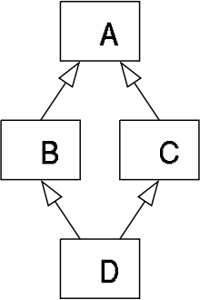

_**M**_ethod Resolution Order or 'MRO' in short, denotes the way a programming language resolves a method or attribute. This post looks into how Method Resolution Order works, using Python.

Python supports classes inheriting from other classes. The class being inherited is called the Parent/Super class, while the class that inherits is called the Child/Sub class.

While inheriting from another class, the interpreter needs a way to resolve the methods that are being called via an instance. Hence a method resolution order is needed.

_**Example 0:**_

\[code language="python"\]

class A(object): def my\_func(self): print("Doing this in class A")

class B(A): def my\_func(self): print("Doing this in class B")

my\_instance = B() my\_instance.my\_func() \[/code\]

### **Structure:**

1. We've two classes,  `class A` and `class B`.
2. Instantiate `class B` as `my_instance`.
3. Call the `my_func()` method through the `my_instance` instance.

Where is the method fetched from? From `class B` or `class A`?

### **How does the code work?**

This should be pretty obvious, the answer would be `class B`. But why is it being called from `class B` and not from `class A`?

Answer : The **Method Resolution Order** \[MRO\].

To understand this in depth, let's check another example:

_**Example 1:**_

\[code language="python"\] class A(object): def my\_func(self): print("Doing this in Class A")

class B(A): pass

class C(object): def my\_func(self): print("Doing this in Class C")

class D(B, C): pass

my\_instance = D() my\_instance.my\_func() \[/code\]

### **Structure**_**:**_

1. Four classes, class `A`, `B`, `C`, and `D`.
2. Class `D` inherits from both `B` and `C`
3. Class `B` inherits from `A`.
4. Class `A` and `C` doesn't inherit from any super classes, but from the `object` base class due to being new-style classes.
5. Class `A` and class `C` both have a method/function named `my_func()`.
6. Class `D` is instantiated through `my_instance`

If we were to call the method `my_func()` through the `my_instance()` instance, which class would it be called from? Would it be from class `A` or class `C`?

### **How does the code work?**

This won't be as obvious as _**Example 0.**_ 

1. The instance `my_instance()` is created from class `D`.
2. Since class `D`inherits from both class `B` and `C`, the python interpreter searches for the method `my_func()` in both of these classes.
3. The intrepreter finds that class `B` inherits from class `A`, and class `C` doesn't have any super classes other than the default `object` class.
4. Class `A` and class `C` both has the method named `my_func()`, and hence has to be called from one of these.
5. **Python follows a depth-first lookup order and hence ends up calling the method from class A.**

Following the depth-first Method Resolution Order, the lookup would be in the order :

_**Class D -> Class B -> Class C**_

Let's check another example, which can be a bit more complex.

_**Example 2:**_

\[code language="python"\] class A(object): def my\_func(self): print("Doing this in A")

class B(A): pass

class C(A): def my\_func(self): print("doing this in C")

class D(B, C): pass

my\_instance = D() my\_instance.my\_func() \[/code\]

### **Structure:**

1. Four classes, class `A`, `B`, `C`, and `D`
2. Class `D` inherits from both `B` and `C`
3. Class `B` inherits from class `A`.
4. Class `C` inherits from class `A`.
5. Class `A` inherits from the default base class `object`.

**This sort of inheritance is called the `Diamond Inheritance` or the `Deadly Diamond of death` and looks like the following:**

 

_Image courtsey : [Wikipedia](https://en.wikipedia.org/wiki/Multiple_inheritance)_

### **How does the code work?**

Following the depth-first Method Resolution Order, the lookup would be in the order :

_**Class D -> Class B -> Class A -> Class C -> Class A**_

In order to avoid ambiguity while doing a lookup for a method where multiple classes are inherited and involved, the MRO lookup has changed slightly from Python 2.3 onwards.

It still goes for the depth-first order, but if the occurrence of a class happens multiple times in the MRO path, it removes the initial occurrence and keeps the latter.

Hence, the look up order in _**Example 2**_ becomes:

_**Class D -> Class B -> Class C -> Class A.**_

**NOTE: Python provides a method for a class to lookup the Method Resolution Order. Let's recheck Example 2 using that.**

\[code language="python"\] class A(object): def my\_func(self): print("Calling this from A")

class B(A): pass

class C(A): def my\_func(self): print("\\nCalling this from C")

class D(B, C): pass

my\_instance = D() my\_instance.my\_func()

print("\\nPrint the Method Resolution Order") print(D.mro()) print(D.\_\_bases\_\_) \[/code\] This should print:

\[code language="python"\] # python /tmp/Example-2.py

Calling this from C

Print the Method Resolution Order class '\_\_main\_\_.D', class '\_\_main\_\_.B', class '\_\_main\_\_.C', class '\_\_main\_\_.A', type 'object'

(, ) \[/code\]

### Takeaway:

1. Python follows a depth-first order for resolving methods and attributes.
2. In case of multiple inheritances where the methods happen to occur more than once, python omits the first occurrence of a class in the Method Resolution Order.
3. The `<class>.mro()`methods helps to understand the Medthod Resolution Order.
4. The \`\_\_bases\_\_\` and \`\_\_base\_\_\` magic methods help to understand the Base/Parent classes of a Sub/Child class.

### References:

1. [https://en.wikipedia.org/wiki/Multiple\_inheritance](https://en.wikipedia.org/wiki/Multiple_inheritance)
